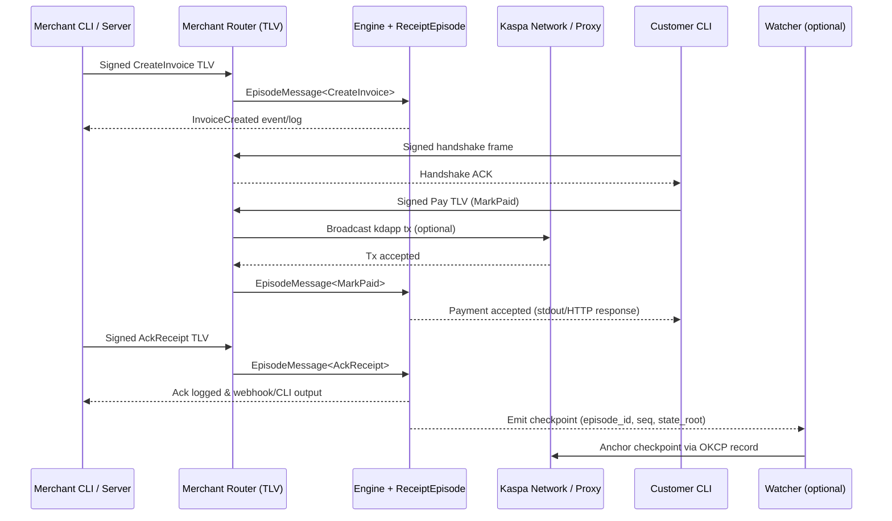

# Payment Flows in the Merchant & Customer Examples

The merchant (`kdapp-merchant`) and customer (`kdapp-customer`) examples showcase how kdapp episodes can orchestrate an on-chain payment handshake while keeping most of the UX off-chain. This document captures the main data paths and failure surfaces so you can reason about the overall flow without diving into the source code first.

## Core Roles

- **Customer CLI** – Creates TLV packets that carry signed `EpisodeMessage<CustomerCommand>` payloads. It performs the router handshake automatically before sending commands such as `pay` or `ack`.
- **Merchant Router (UDP/TCP)** – Validates the handshake, verifies signatures on TLV frames, and forwards serialized `EpisodeMessage<MerchantCommand>` payloads into the engine.
- **Engine + ReceiptEpisode** – Runs the `ReceiptEpisode` state machine. It validates commands, keeps rollback history, and notifies handlers (logging, checkpoints, webhooks).
- **Kaspa Network & Proxy** – Optional path for on-chain propagation. The router can forward accepted commands to the Kaspa network through the proxy so other listeners receive the transaction stream.
- **Watcher / Guardian (optional)** – Listens for checkpoints emitted by the merchant handler and anchors the latest acknowledged state on-chain.

## Happy Path



**Notes**
- The customer only touches the network once the invoice exists and the TLV handshake succeeds.
- When the proxy path is active, any kdapp listener that shares the same `PrefixType` / `PatternType` receives the payment command directly from the network.
- Checkpoints are emitted when receipts are acknowledged or at a periodic cadence. Anchoring is optional but gives durable proof of settlement.

## Failure Scenarios

```mermaid
sequenceDiagram
    participant Customer as Customer CLI
    participant Router as Merchant Router (TLV)
    participant Engine as Engine + ReceiptEpisode
    participant MerchantCLI as Merchant CLI / Server

    Customer->>Router: Signed handshake frame
    alt Invalid signature or replay
        Router-->>Customer: Reject & drop connection
    else Handshake accepted
        Router-->>Customer: Handshake ACK
        Customer->>Router: Signed Pay TLV (MarkPaid)
        Router->>Engine: EpisodeMessage<MarkPaid>
        alt Engine rejects command
            Engine-->>Router: EpisodeError (InvalidAmount / DuplicatePayment)
            Router-->>Customer: TLV error frame; invoice remains open
        else Payment recorded
            Engine-->>Customer: Payment accepted (stdout/HTTP response)
            MerchantCLI->>Router: Signed AckReceipt TLV
            Router->>Engine: EpisodeMessage<AckReceipt>
            alt Not enough confirmations yet
                Engine-->>Router: EpisodeError (InsufficientConfirmations)
                Router-->>MerchantCLI: Ack deferred; retry later
            else Ack succeeds
                Engine-->>MerchantCLI: Receipt acknowledged
            end
        end
    end
```

### Failure Highlights

- **Handshake failures** – The router drops connections if the customer skips the handshake, signs with the wrong key, or replays stale nonces.
- **Command validation errors** – `ReceiptEpisode` refuses duplicate invoice IDs, mismatched payment amounts, or double spends detected through `used_carrier_txs`. These are surfaced to the client as TLV error frames.
- **Confirmation gating** – `AckReceipt` requires the watcher policy (configurable via HTTP) to report sufficient on-chain confirmations. If the underlying Kaspa transaction is still shallow, the merchant must retry later.
- **Reorg safety** – Any accepted command is paired with a rollback token. If the proxy observes a Kaspa reorg, the engine replays rollback tokens to restore a consistent invoice state.

## Related Tools & Commands

- Merchant CLI: `cargo run -p kdapp-merchant -- create --episode-id <id> --invoice-id <u64> --amount <u64>`
- Customer CLI: `cargo run -p kdapp-customer -- pay --episode-id <id> --invoice-id <u64> --payer-private-key <hex>`
- Watcher: `cargo run -p kdapp-merchant -- watcher --kaspa-private-key <hex> --bind 127.0.0.1:9590`

Use these commands together to reproduce the diagrams above and explore how the router surfaces errors during unhappy paths.
